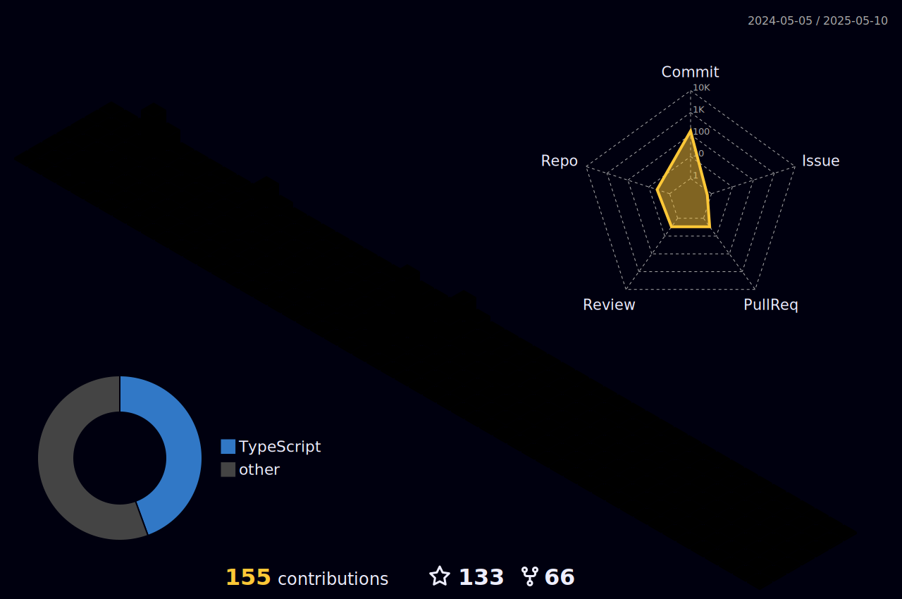

# Ola , Estudante na area de dados...  :) 
### Bem-vindo ao meu GitHub! 

  

---

---

  
## 🛠 Tecnologias e Ferramentas
#### Linguagens de Programação:

 

   

---
 

<picture>
  <source media="(prefers-color-scheme: dark)" srcset="https://raw.githubusercontent.com/leonardocorreia08/leonardocorreia08/output/pacman-contribution-graph-dark.svg">
  <source media="(prefers-color-scheme: light)" srcset="https://raw.githubusercontent.com/leonardocorreia08/leonardocorreia08/output/pacman-contribution-graph.svg">
  
</picture>

###
---

  

### Conecte-se comigo

### Meus Principais Projetos.
  ##
  ##

  
  

---
## 📊 GitHub Estatísticas

 

<table cellpadding="0">
  <tr style="padding: 0">
    <!-- GitHub Stats Card -->  
    <td valign="top"></td>
    <!-- GitHub Top Language Card -->
    <td valign="top"></td>
  </tr>
</table>

---
"O lifetime learning é a chave para um crescimento contínuo, onde o conhecimento se renova e expande, transformando cada etapa da vida."

 

 

   
  
 
 

 <source media="(prefers-color-scheme: dark)" srcset="https://raw.githubusercontent.com/leonardocorreia08/leonardocorreia08/output/Snake-contribution-graph-dark.svg">
  <source media="(prefers-color-scheme: light)" srcset="https://raw.githubusercontent.com/leonardocorreia08/leonardocorreia08/output/Snake-contribution-graph.svg">
  

 <!--<picture>
  <source media="(prefers-color-scheme: dark)" srcset="github-snake-dark.svg" />
  <source media="(prefers-color-scheme: light)" srcset="github-snake.svg" />
  
 </picture> -->
