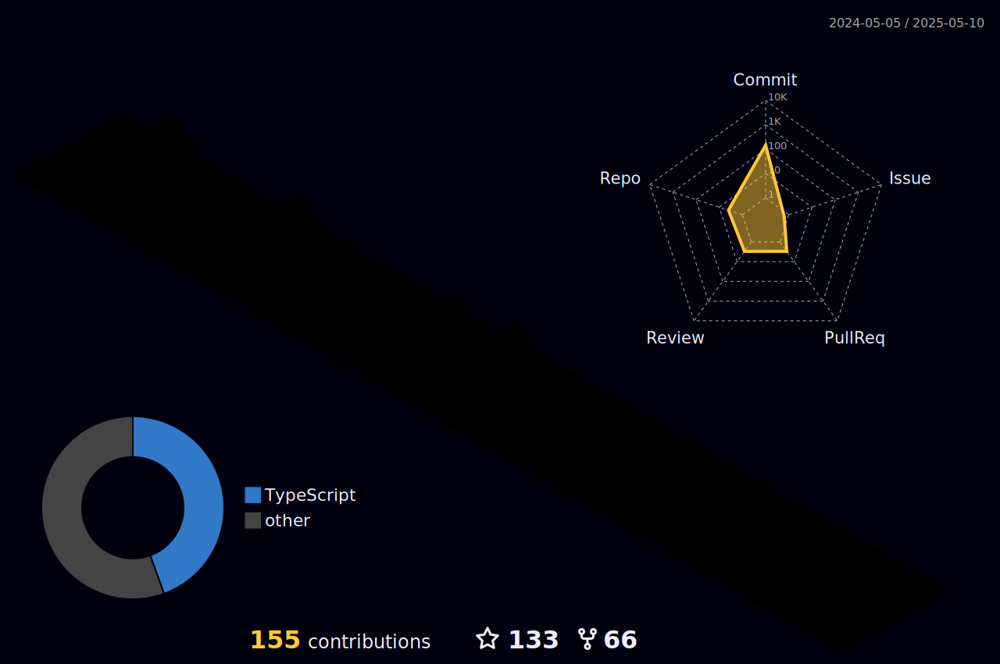

# Ola, Estudante na area de IA e dados... :) 
### Bem-vindo ao meu GitHub!

---

## 🛠 Tecnologias e Ferramentas

#### Linguagens de Programação:

 

 

---

<picture>
  <source media="(prefers-color-scheme: dark)" srcset="https://raw.githubusercontent.com/leonardocorreia08/leonardocorreia08/output/pacman-contribution-graph-dark.svg">
  <source media="(prefers-color-scheme: light)" srcset="https://raw.githubusercontent.com/leonardocorreia08/leonardocorreia08/output/pacman-contribution-graph.svg">
  
</picture>

---

### Conecte-se comigo

### Meus Principais Projetos

---

## 📊 GitHub Estatísticas

 

---

## 🕹️ Jogos de Contribuição

<picture>
  <source media="(prefers-color-scheme: dark)" srcset="https://raw.githubusercontent.com/leonardocorreia08/leonardocorreia08/output/bomberman-contribution-graph-dark.svg">
  <source media="(prefers-color-scheme: light)" srcset="https://raw.githubusercontent.com/leonardocorreia08/leonardocorreia08/output/bomberman-contribution-graph.svg">
  
</picture>

